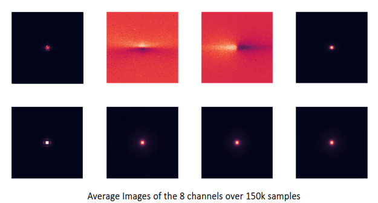
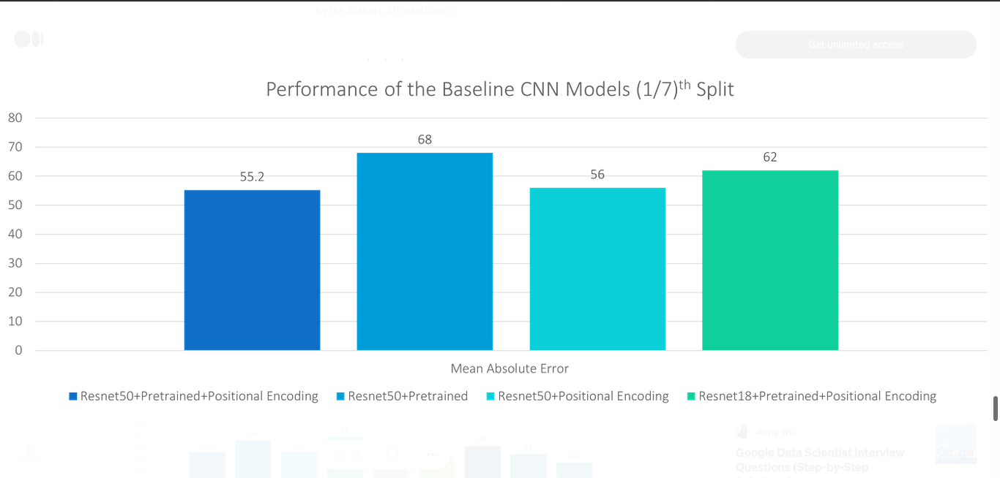

# CNN Baseline Model

This folder contains all the required files to train/test a baseline CNN model.

**For the full description please refer to the final report: [link](https://medium.com/@JaiBardhan/google-summer-of-code-2022-with-ml4sci-e2e-top-mass-regression-using-graph-neural-networks-3268a091660b)**

## Table of Contents
- [CNN Baseline Model](#cnn-baseline-model)
  - [Table of Contents](#table-of-contents)
  - [Data](#data)
  - [The baseline model](#the-baseline-model)
  - [Results](#results)
  - [How to run?](#how-to-run)
    - [Using the example notebook](#using-the-example-notebook)
    - [Install the requirements](#install-the-requirements)
    - [From the terminal shell](#from-the-terminal-shell)
  - [CNN Checklist](#cnn-checklist)

## Data


The image contains eight channels (Transverse momentum, dz, Track Information, and ECAL and HCAL projection). The dataset additionally contains some basic information regarding the experimental setup ($i\phi$ and $i\theta$). 

## The baseline model

The CNN baseline is contructed using a (pretrained) Resnet backbone with a regression head. 

## Results


The CNN baseline with Resnet50 backbone, positional encoding and output scaling performs the best. Other configurations perform either similarly or far worse.  

## How to run?

### Using the example notebook

The provided `example.ipynb` notebook handles all the aspect of training/testing - downloading the dataset, installing the requirements and running the training script.

### Install the requirements

The requirements for the project can be installed by:

```bash
pip install -r requirements.txt
```

### From the terminal shell

The `main.py` file implements the training/testing loop. A simple run with default values can be done using 
```bash
python main.py
```
Arguments can also be provided to change the training/testing:
```
usage: main.py [-h] [--num_epochs NUM_EPOCHS] [--device {cpu,cuda}] [--name NAME] [--save_path SAVE_PATH]
               [--data_dir DATA_DIR] [--train_batch_size TRAIN_BATCH_SIZE] [--val_batch_size VAL_BATCH_SIZE]
               [--test_batch_size TEST_BATCH_SIZE] [--num_files NUM_FILES] [--val_ratio VAL_RATIO] [--test_ratio TEST_RATIO]
               [--pretrained] [--lr LR] [--lr_step LR_STEP] [--lr_gamma LR_GAMMA] [--criterion_type {mse,l2,l1,smoothl1}]
               [--criterion_beta CRITERION_BETA] [--use_pe] [--num_pe_scales NUM_PE_SCALES] [--use_zero_suppression]
               [--min_threshold MIN_THRESHOLD] [--output_mean_scaling] [--output_mean_value OUTPUT_MEAN_VALUE]
               [--output_norm_scaling] [--output_norm_value OUTPUT_NORM_VALUE]
               [--model {resnet18,resnet34,resnet50,resnet101}] [--scale_histogram] [--plot] [--debug]
               [--optim {adam,adamw,rmsprop,sgd}] [--sched_type {step,ca_wm}] [--min_lr MIN_LR] [--T_0 T_0]

optional arguments:
  -h, --help            show this help message and exit
  --num_epochs NUM_EPOCHS
                        Number of epochs to train
  --device {cpu,cuda}   Which device to run the models on
  --name NAME           Name of the run
  --save_path SAVE_PATH
                        Path to save the final model
  --data_dir DATA_DIR   Path to the root dir of the dataset
  --train_batch_size TRAIN_BATCH_SIZE
                        Train Batch Size
  --val_batch_size VAL_BATCH_SIZE
                        Validation Batch Size
  --test_batch_size TEST_BATCH_SIZE
                        Test Batch Size
  --num_files NUM_FILES
                        Number of dataset files to load
  --val_ratio VAL_RATIO
                        Ratio of the dataset to take as the test set
  --test_ratio TEST_RATIO
                        Ratio of the dataset to take as the validation set
  --pretrained          Whether to use the pretrained network
  --lr LR               The learning rate of the model
  --lr_step LR_STEP     The number of steps to reduce the LR of the optimizer
  --lr_gamma LR_GAMMA   The factor by which to reduce the LR of the optimizer
  --criterion_type {mse,l2,l1,smoothl1}
                        Which criterion to use for training
  --criterion_beta CRITERION_BETA
                        Beta for the specific criterion if applicable
  --use_pe              Whether to use Positional Encoding
  --num_pe_scales NUM_PE_SCALES
                        Number of PE scales to use
  --use_zero_suppression
                        Whether to use zero supression
  --min_threshold MIN_THRESHOLD
                        The min threshold for the zero suppression
  --output_mean_scaling
                        Whether to perform mean scaling on the output
  --output_mean_value OUTPUT_MEAN_VALUE
                        The mean to subtract from the mean
  --output_norm_scaling
                        Whether to divide the output by normalizing constant
  --output_norm_value OUTPUT_NORM_VALUE
                        The the normalizing constant to divide the output by
  --model {resnet18,resnet34,resnet50,resnet101}
                        Which model to use for the CNN backbone
  --scale_histogram     Whether to scale as histograms
  --plot                Whether to scatter plot prediction vs ground truth
  --debug
  --optim {adam,adamw,rmsprop,sgd}
                        Which optimizer to use
  --sched_type {step,ca_wm}
                        Which type of scheduler to use
  --min_lr MIN_LR       Minimum LR for the cosine annealing LR scheduler
  --T_0 T_0             Number of iterations for the first restart
```

## CNN Checklist
- [x] Basic data loaders
- [x] Basic logging on weights and biases
- [x] Code for obtaining channel avg and std for the image dataset
- [x] Code for the CNN baseline
- [x] Basic augmentations and Loss Function testing for CNNs
