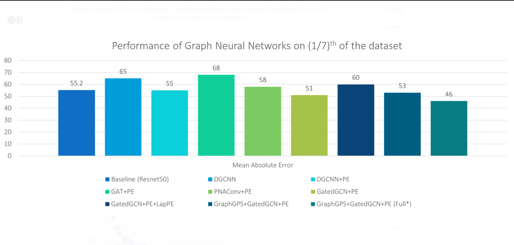

# Graph Neural Network Regression Model

This folder contains all the required files to train/test the GNN model.

**For the full description please refer to the final report: [link](https://medium.com/@JaiBardhan/google-summer-of-code-2022-with-ml4sci-e2e-top-mass-regression-using-graph-neural-networks-3268a091660b)**

## Table of Contents
- [Graph Neural Network Regression Model](#graph-neural-network-regression-model)
  - [Table of Contents](#table-of-contents)
  - [Data Preprocessing](#data-preprocessing)
  - [Graph Neural Network Models](#graph-neural-network-models)
    - [Dynamic Graph Convolution](#dynamic-graph-convolution)
    - [Graph Attention Network (GAT)](#graph-attention-network-gat)
    - [Principled Neighborhood Aggregation](#principled-neighborhood-aggregation)
    - [Residual Gated Graph Convolution Networks](#residual-gated-graph-convolution-networks)
    - [GraphGPS](#graphgps)
  - [Results](#results)
  - [How to run?](#how-to-run)
    - [Using the example notebook](#using-the-example-notebook)
    - [Install the requirements](#install-the-requirements)
    - [From the terminal shell](#from-the-terminal-shell)
  - [GNN Checklists](#gnn-checklists)

## Data Preprocessing

To convert the jet images to graphs, two different approaches were tested. The above image is the result from one such method. 

## Graph Neural Network Models

### Dynamic Graph Convolution
Dynamic Graph Convolution (DGCNN) or EdgeConv introduces graph edge convolutions for point clouds. The main approach of the paper is to allow the network to learn the appropriate manifold to form graphs from point clouds (granted that there is no apparent underlying graph structure from point clouds at the beginning).

> We consider this approach due to the lack of a natural underlying graph structure in our constructed graphs and the model’s prior performance in High Energy Physics tasks.

### Graph Attention Network (GAT)
Graph Attention Network (GAT) leverages mask self-attentional layers to address the shortcomings of previous graph convolution methods. Previous methods struggled with collating information effectively from the neighbors of a node leading to the loss of crucial information or the squashing of information. By allowing nodes to attend to their neighbors, the network allows specifying different weights to different nodes in the neighborhood. This allows for effective collation of information and prevents squashing.

> The choice of this architecture was motivated due to the presence of many noisy nodes in the constructed graph. The better modelling choice in GATs would enable the nodes to attend to essential features in the neighborhood.

### Principled Neighborhood Aggregation
Works prior to this had focused on the expressive power of the network for isomorphism and countable spaces. The approach extends this theoretical framework to include continuous features (which is, in fact, the case with our data). The proposed approach combines multiple aggregators with degree scalars (which generalize the sum aggregation) to achieve better performance for many real-world tasks.

> This model was chosen due to its competitive performance on graph regression tasks in modern benchmarks. Furthermore, the model had shown remarkable performance in chemistry-related graph regression tasks.

### Residual Gated Graph Convolution Networks
Residual Gated Graph Convolution Networks are developed as the generalization of the LSTMs and ConvNets by combining the gating operation with graph convolutions. This model has impressive results in many modern graph benchmarks, especially graph regression tasks.

> This model was chosen due to its competitive performance on graph regression tasks in modern benchmarks. Furthermore, the model’s gating mechanism behaves similarly to GAT to prevent the squashing of information by noisy nodes.

### GraphGPS
Graph Neural Networks are plagued with issues of long-range interactions due to over smoothing and over squashing. GraphGPS provides a general, flexible framework to address this issue. The method proposes to combine local convolutions using GNN layers with a global transformer (attention-like) architecture to allow for the passing of messages across the nodes and facilitate long-range interactions.

> The choice for GraphGPS was motivated by the relatively enormous size of the generated graphs from the jet images.

## Results


GraphGPS performs the best from all the other models. This may be due to the better modelling capability of the complex model compared to the simpler GNNs.

## How to run?

### Using the example notebook

The provided `example.ipynb` notebook handles all the aspect of training/testing - downloading the dataset, installing the requirements and running the training script.

### Install the requirements

The requirements for the project can be installed by:

```bash
pip install -r requirements.txt
```

### From the terminal shell

The `main.py` file implements the training/testing loop. A simple run with default values can be done using 
```bash
python main.py
```
Arguments can also be provided to change the training/testing:

```
usage: main.py [-h] [--num_epochs NUM_EPOCHS] [--device {cpu,cuda}] [--name NAME] [--save_path SAVE_PATH]
               [--data_dir DATA_DIR] [--train_batch_size TRAIN_BATCH_SIZE] [--val_batch_size VAL_BATCH_SIZE]
               [--test_batch_size TEST_BATCH_SIZE] [--num_files NUM_FILES] [--val_ratio VAL_RATIO] [--test_ratio TEST_RATIO]
               [--pretrained] [--lr LR] [--lr_step LR_STEP] [--lr_gamma LR_GAMMA] [--criterion_type {mse,l2,l1,smoothl1}]
               [--criterion_beta CRITERION_BETA] [--use_pe] [--num_pe_scales NUM_PE_SCALES] [--min_threshold MIN_THRESHOLD]
               [--output_mean_scaling] [--output_mean_value OUTPUT_MEAN_VALUE] [--output_norm_scaling]
               [--output_norm_value OUTPUT_NORM_VALUE] [--model {dgcnn,gat,pna,gatedgcn,gps}]
               [--point_fn {total,channel_wise}] [--plot] [--edge_feat {none,R}] [--scale_histogram] [--predict_bins]
               [--min_mass MIN_MASS] [--max_mass MAX_MASS] [--num_bins NUM_BINS] [--debug] [--sched_type {step,ca_wm}]
               [--min_lr MIN_LR] [--T_0 T_0] [--optim {adam,adamw,rmsprop,sgd}] [--LapPE] [--LapPEnorm {sym,rw,None}]
               [--LapPEmax_freq LAPPEMAX_FREQ] [--LapPEeig_norm LAPPEEIG_NORM] [--RWSE] [--RWSEkernel_times RWSEKERNEL_TIMES]
               [--save_data] [--gps_mpnn_type {None,gatedgcn,gat,edgeconv,pnaconv}]
               [--gps_global_type {None,transformer,performer}] [--gps_num_heads GPS_NUM_HEADS] [--gps_dim_h GPS_DIM_H]
               [--num_gps_layers NUM_GPS_LAYERS] [--multi_gpu]

optional arguments:
  -h, --help            show this help message and exit
  --num_epochs NUM_EPOCHS
                        Number of epochs to train
  --device {cpu,cuda}   Which device to run the models on
  --name NAME           Name of the run
  --save_path SAVE_PATH
                        Path to save the final model
  --data_dir DATA_DIR   Path to the root dir of the dataset
  --train_batch_size TRAIN_BATCH_SIZE
                        Train Batch Size
  --val_batch_size VAL_BATCH_SIZE
                        Validation Batch Size
  --test_batch_size TEST_BATCH_SIZE
                        Test Batch Size
  --num_files NUM_FILES
                        Number of dataset files to load
  --val_ratio VAL_RATIO
                        Ratio of the dataset to take as the test set
  --test_ratio TEST_RATIO
                        Ratio of the dataset to take as the validation set
  --pretrained          Whether to use the pretrained network
  --lr LR               The learning rate of the model
  --lr_step LR_STEP     The number of steps to reduce the LR of the optimizer
  --lr_gamma LR_GAMMA   The factor by which to reduce the LR of the optimizer
  --criterion_type {mse,l2,l1,smoothl1}
                        Which criterion to use for training
  --criterion_beta CRITERION_BETA
                        Beta for the specific criterion if applicable
  --use_pe              Whether to use Positional Encoding
  --num_pe_scales NUM_PE_SCALES
                        Number of PE scales to use
  --min_threshold MIN_THRESHOLD
                        The min threshold for the zero suppression
  --output_mean_scaling
                        Whether to perform mean scaling on the output
  --output_mean_value OUTPUT_MEAN_VALUE
                        The mean to subtract from the mean
  --output_norm_scaling
                        Whether to divide the output by normalizing constant
  --output_norm_value OUTPUT_NORM_VALUE
                        The the normalizing constant to divide the output by
  --model {dgcnn,gat,pna,gatedgcn,gps}
                        The backbone GNN to use
  --point_fn {total,channel_wise}
                        How to obtain points from the image
  --plot                Whether to plot the predicted vs ground truth results
  --edge_feat {none,R}  Which method to use to obtain edge_feat
  --scale_histogram     Whether to scale based on histogram scales provided
  --predict_bins        Whether to also predict a binned mass
  --min_mass MIN_MASS   Minimum mass of the output
  --max_mass MAX_MASS   Maximum mass of the output
  --num_bins NUM_BINS   Number of bins for binning the output mass
  --debug
  --sched_type {step,ca_wm}
                        Which type of scheduler to use
  --min_lr MIN_LR       Minimum LR for the cosine annealing LR scheduler
  --T_0 T_0             Number of iterations for the first restart
  --optim {adam,adamw,rmsprop,sgd}
                        Which optimizer to use
  --LapPE               Whether to use the Laplacian PE encoding transform
  --LapPEnorm {sym,rw,None}
  --LapPEmax_freq LAPPEMAX_FREQ
                        Maximum number of top smallest frequencies / eigenvecs to use
  --LapPEeig_norm LAPPEEIG_NORM
                        Normalization for the eigen vectors of the Laplacian
  --RWSE                Whether to perform the Random Walk Encoding Transform
  --RWSEkernel_times RWSEKERNEL_TIMES
                        List of k-steps for which to compute the RW landings
  --save_data           Whether to store the data object for each sample
  --gps_mpnn_type {None,gatedgcn,gat,edgeconv,pnaconv}
                        Local MPNN for the GraphGPS Layer
  --gps_global_type {None,transformer,performer}
                        The Global Attention Module for the GraphGPS Layer
  --gps_num_heads GPS_NUM_HEADS
                        The number of heads for the self attn of the GraphGPS layer
  --gps_dim_h GPS_DIM_H
                        The dim_h of the GraphGPS Layer
  --num_gps_layers NUM_GPS_LAYERS
                        Number of GraphGPS Layers to use
  --multi_gpu           Whether to use multiple gpus using DataParallel
```

## GNN Checklists
- [x] GNN baseline
- [x] Different ways to obtain points from image
- [x] Different ways to obtain neighbourhood/edges  
- [x] Perform basic testing with different GNN architectures
- [x] GraphGPS and newer methods
- [x] LapPE, RWSE, and other graph/node encoding methods
- [x] Explore with larger models