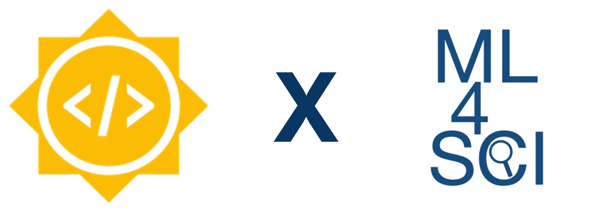

<h1 align='center'> Graph Neural Networks for End-to-End Top Mass Reconstruction for the CMS Experiment </h1>

<strong>Official repository for Google Summer of Code 2022</strong> 
The primary goal of the project is explore the use of Graph Neural Networks for Mass Regression of Top Particle Events. 

**The associated detailed report for the project can be found [here](https://medium.com/@JaiBardhan/google-summer-of-code-2022-with-ml4sci-e2e-top-mass-regression-using-graph-neural-networks-3268a091660b)** 

***
## Table of Content
- [Table of Content](#table-of-content)
- [Motivation](#motivation)
- [Data](#data)
- [Structure of the Repository](#structure-of-the-repository)
- [Acknowledgement](#acknowledgement)

## Motivation
While CNNs have become ubiquitous in Particle Physics, they do not possess rotational equivariance or other 3D understanding (though there have been works recently to add these features). Furthermore, since CNNs learn kernels, they work much better with dense images rather than sparse ones. Given that the input data is very sparse, and the problem requires careful understanding of the 3D geometry, it motivates the need for GNNs. 

## Data

The image contains eight channels (Transverse momentum, dz, Track Information, and ECAL and HCAL projection). The dataset additionally contains some basic information regarding the experimental setup ($i\phi$ and $i\theta$).

## Structure of the Repository

The repository has 2 subdirectories: `CNN` and `GNN`. The `CNN` directory contains the code and respective information for the CNN baseline developed and tested. The `GNN` directory contains the code and information for the various GNN architectures and ideas explored.

**[Link to the CNN Directory](CNN/)**

**[Link to the GNN Directory](GNN/)**

## Acknowledgement
I want to thank my mentors, Sergei Gleyzer, Ana Maria Slivar, Bhim Bam, Colin Crovella and Emanuele Usai, and the entire ML4SCI community for their continued support and guidance. I had a wonderful time working on my GSoC project.

I would also like to thank Google for providing me this opportunity to work with the ML4Sci Organization.